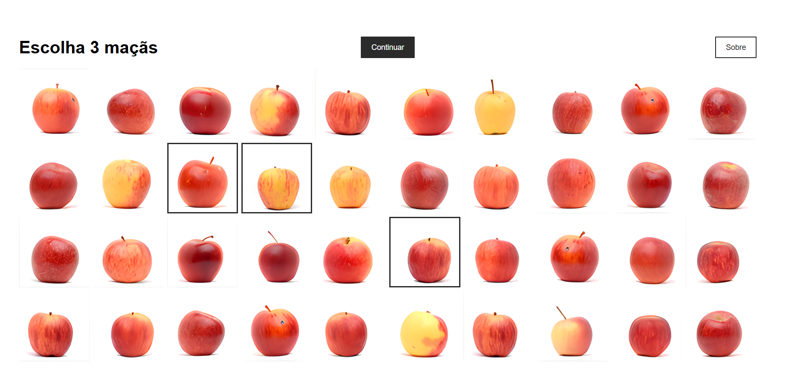

# REA_ApplePicker

### Realidades APple Picker V2.1   01/10/25

### APPP (HTML/CSS/JS + Node/Express)
> **Versão:** 2.1.0 

Proposta de interface para o projeto [Nome do Projeto?]. Por enquanto, exibe uma galeria de 40 maçãs, permite a seleção de exatamente 3 imagens, sorteia uma das imagens (no futuro, substituir por nova imagem) exibindo o resultado do processo e um grid ordenado por um score acumulado ao longo das seleções. O backend é um servidor **Node.js + Express** simples que lê/escreve um `data.json` com as informações associadas às imagens.





---

## 📁 Estrutura de Pastas

```
REA_APPP_v2/
├── server.js          # Servidor Express (endpoints /images e /score)
├── data.json          # Base de imagens (id, src, score) — atualizada em runtime
├── package.json       # (criado pelo npm init)
│
└── public/
    ├── index.html     # Tela inicial (grid embaralhado + seleção de 3)
    ├── loading.html   # Tela de carregamento (4s, spinner centralizado)
    ├── result.html    # Tela de resultado (nova img à esquerda + grid à direita)
    ├── style.css      # Conjunto de Estilos
    ├── inicio.js      # Lógica da tela inicial
    ├── loading.js     # Redireciona para result.html após 4s
    ├── result.js      # Monta vencedora + grid ordenado por score
    └── assets/        # Maças vão aqui .jpg/.png/etc (coloque aqui)
```

---

## 🧩 Fluxo do App

1. **Tela inicial (`index.html`)**  
   - Mostra as 40 imagens **embaralhadas** em um grid responsivo.  
   - Usuário seleciona **exatamente 3** (pode desmarcar).  
   - Ao clicar **Continuar**, o APPP:
     - **Sorteia** 1 entre as 3,
     - Envia `POST /score` somando **+1** para cada selecionada e **+1 extra** para a sorteada,
     - Salva somente o `winner` em `sessionStorage`,
     - Vai para `loading.html`.

2. **Tela de carregamento (`loading.html`)**  
   - Spinner e texto centralizados, **4 segundos**, depois segue para `result.html` (depois vamos substituir por um tutorial sobre o APPP?)

3. **Resultados (`result.html`)**  
   - **Esquerda:** nova imagem (vencedora do sorteio) grande + `ID` e `Score`.  
   - **Direita:** grid **ordenado por score (desc)**; cada item mostra `ID` e `Score`.  
   - Botão **“Escolher Novas Maçãs”** volta para `index.html`.

---

## 🔧 Pré‑requisitos para rodar

- **Node.js** LTS recomendado (≥ 18).  
  Verifique com:
  ```bash
  node -v
  ```

---

## ▶️ Como Rodar

1. **Instalar dependências** (na pasta `REA_APPP_v2/`):
   ```bash
   npm init -y
   npm install express
   ```

2. **Executar o servidor**:
   ```bash
   node server.js
   ```
   Acesse: **http://localhost:3000**

3. (Opcional) **Recarregar automático** com `nodemon`:
   ```bash
   npm install -g nodemon
   nodemon server.js
   ```

> 🔁 Se você **trocar imagens** ou **editar `data.json` manualmente**, reinicie o servidor para garantir a leitura correta (`Ctrl+C` para parar, depois `node server.js`).

---

## 🖼️ Adicionando Imagens

- Coloque os arquivos das novas maças dentro de `public/assets/`.  
- Edite o `data.json` na raiz do projeto seguindo o formato abaixo.

**Formato (`data.json`)**:
```json
[
  { "id": 1, "src": "assets/minha-maca-1.jpg", "score": 0 },
  { "id": 2, "src": "assets/minha-maca-2.jpg", "score": 0 }
  // ...
]
```

> `id`: número único.  
> `src`: caminho relativo dentro de `public/`.  
> `score`: inteiro (acumulado pelo endpoint `/score`).

---

## 🛠️ Endpoints

### `GET /images`
Retorna o conteúdo atual do `data.json`.

**Resposta (exemplo):**
```json
[
  { "id": 1, "src": "assets/maca-1.jpg", "score": 3 },
  { "id": 2, "src": "assets/maca-2.jpg", "score": 7 }
]
```

### `POST /score`
Incrementa o `score` das imagens selecionadas e da vencedora.

**Payload:**
```json
{
  "ids": [12, 7, 33],   // três selecionadas
  "winner": 7           // vencedora entre as três
}
```
**Efeito:**
- `+1` para cada `id` em `ids`
- `+1` extra para `winner`

> O servidor persiste a mudança direto no arquivo `data.json` (sobrescreve com os novos valores).